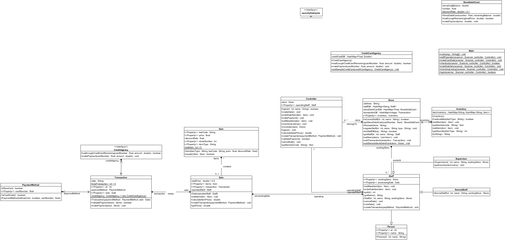
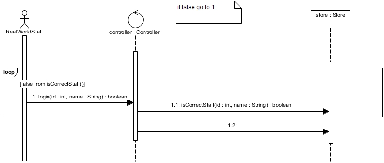
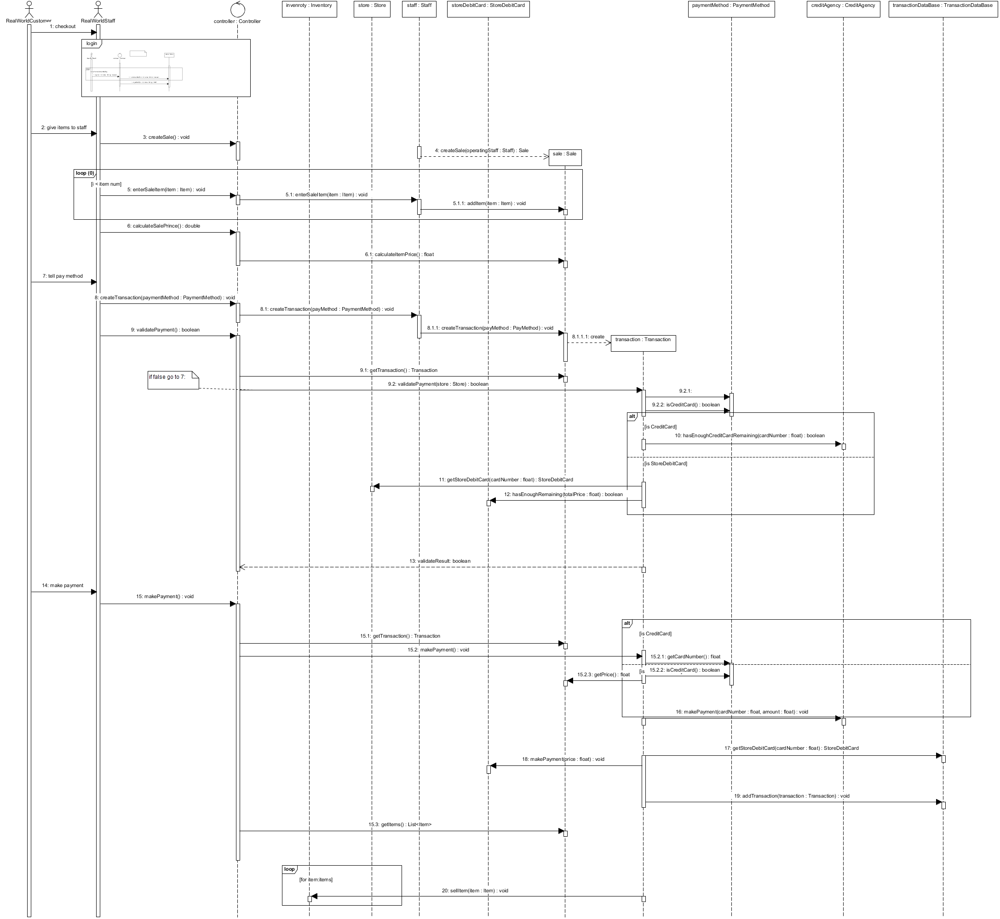
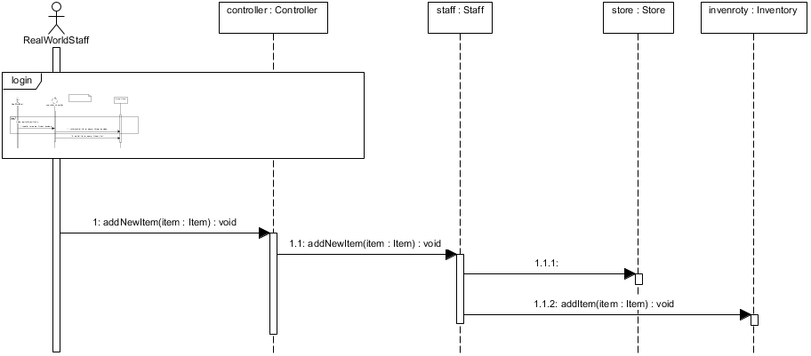
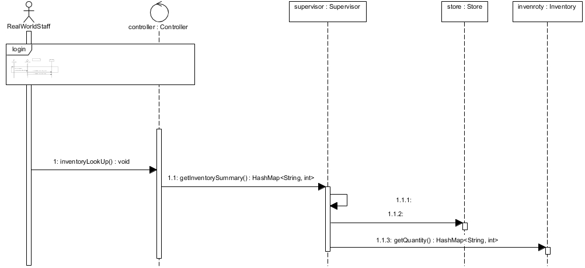
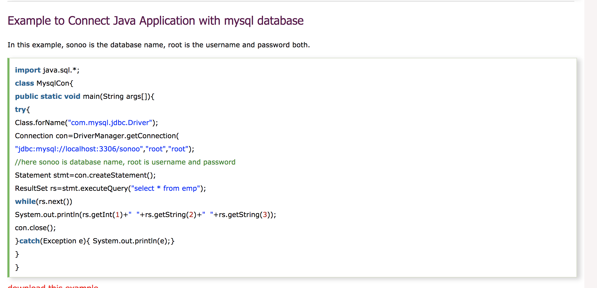

# Mobile-Service-Terminal

By XuLin Yang

## Description:
A design of hand hold shopping store terminal for store staff.
- Based on Java
- Data stored in Java HashMap<> in the system
- Text-Based UI

## Use Case:
- Make credit card Sale
- Make Store debit card Sale with store card discount rate
- Add item to the store inventory
- Store item inventory lookup

## Design:
### Static Model
#### Design Class Diagram
- 
#### Design Sequence Diagram
- login
    - 
- Make Card Sale
    - 
- Add new item
    - 
- Inventory lookup
    - 

## Future Update
- Graphic UI
- Store data in mysql data base
- Dynamically generate sql query by java
- Socket to communicate with the third party organization such CreditAgency
- Use Java to execute query to DB and output query result
    - 

## Hypothetical world
- has credit card:
    - id = 0, credit = 1000.0
    - id = 1, credit = 1000.0
- has store debit card:
    - id = 0, credit = 1000.0, discount rate = 0.1
    - id = 1, credit = 1000.0, discount rate = 0.1
- has Normal Staff:
    - id = 0, name = xuliny
- has Supervisor:
    - id = 1, name = peter

## Sample Execution:
What are you going to do?  
0: quit, 1:login  
1  
Your staff id: 0  
Your name: xuliny  
0:logout, 1:add item, 2:make card sale  
1  
Item type:   
Paper  
Item bar code:   
666666  
Item price:   
5.0  
Item discount rate:   
0.0  
Item added successful.  
0:logout, 1:add item, 2:make card sale  
1  
Item type:   
Paper  
Item bar code:   
666667  
Item price:   
5.0  
Item discount rate:   
0.0  
Item added successful.  
0:logout, 1:add item, 2:make card sale  
1  
Item type:   
Pen  
Item bar code:   
111111  
Item price:   
2.0  
Item discount rate:   
0.0  
Item added successful.  
0:logout, 1:add item, 2:make card sale  
0  
What are you going to do?  
0: quit, 1:login  
1  
Your staff id: 1  
Your name: peter  
0:logout, 1:add item, 2:make card sale, 3: inventory lookup  
3  
{Pen=1, Paper=2}  
0:logout, 1:add item, 2:make card sale, 3: inventory lookup  
0  
What are you going to do?  
0: quit, 1:login  
1  
Your staff id: 1  
Your name: peter  
0:logout, 1:add item, 2:make card sale, 3: inventory lookup  
2  
0:cancel card sale, 1:create a sale  
0  
Sale cancelled  
0:logout, 1:add item, 2:make card sale, 3: inventory lookup  
2  
0:cancel card sale, 1:create a sale  
1  
0:finish enter items, 1:enter more item  
1  
Enter item barcode:   
666666  
0:finish enter items, 1:enter more item  
0  
Total price: 5.0  
0: cancel check out, 1: enter payment Method  
1  
0: pay by credit card; 1: pay by store debit card  
1  

